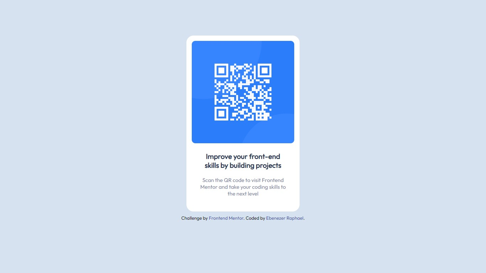

# Frontend Mentor - QR code component solution

This is a solution to the [QR code component challenge on Frontend Mentor](https://www.frontendmentor.io/challenges/qr-code-component-iux_sIO_H). Frontend Mentor challenges help you improve your coding skills by building realistic projects. 

## Table of contents

- [Overview](#overview)
  - [Screenshot](#screenshot)
  - [Links](#links)
- [My process](#my-process)
  - [Built with](#built-with)
  - [Continued development](#continued-development)
  - [Useful resources](#useful-resources)
- [Author](#author)
- [Acknowledgments](#acknowledgments)

## Overview

### Screenshot

### Links

- Solution URL: [GitHub](https://github.com/Ebenezer-Raphael/Qr-Code-Component)
- Live Site URL: [Qr Code Component](https://ebenezer-raphael.github.io/Qr-Code-Component/)

## My process

### Built with

- Semantic HTML5 markup
- CSS custom properties

### Continued development

I wish to be able to integrate the desktop & mobile designs in the same code and deploy both of them depending on the width of the device

### Useful resources

- [HTML & CSS: Design and Build Web Sites - Book by Jon Duckett](https://www.htmlandcssbook.com/) - This helped me to address minor issues in my code and I will use it going forward.

## Author

- GitHub - [@Ebenezer404](https://www.github.com/Ebenezer-Raphael)
- Frontend Mentor - [@Ebenezer404](https://www.frontendmentor.io/profile/Ebenezer-Raphael)
- Twitter - [@EbenezerRaphae1](https://www.twitter.com/EbenezerRaphae1)
